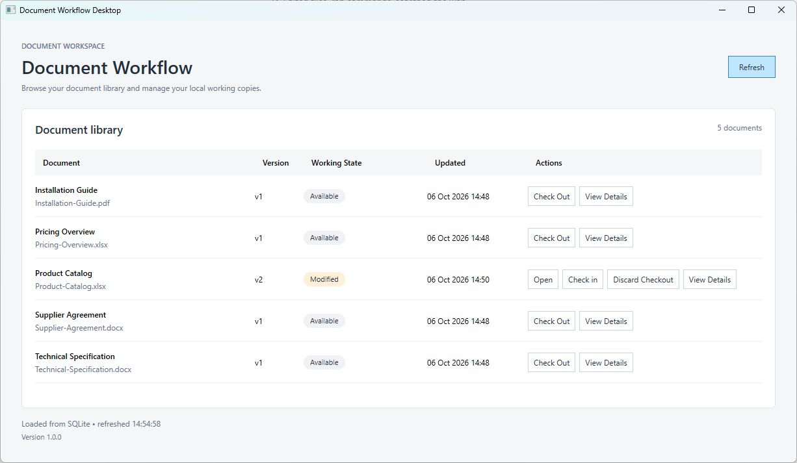
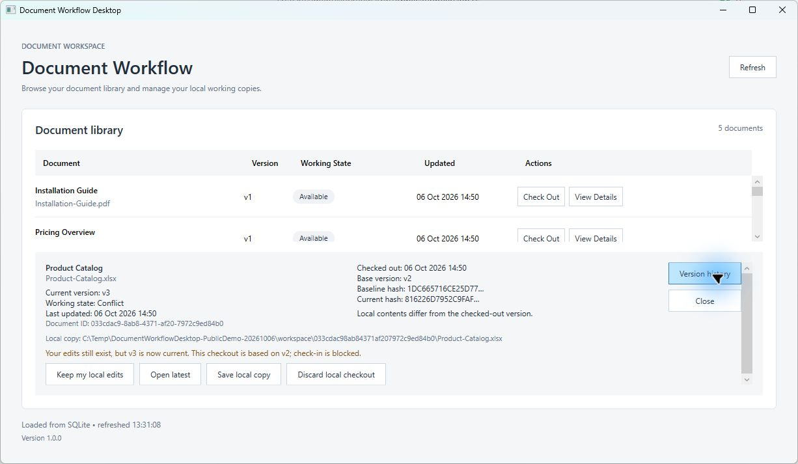
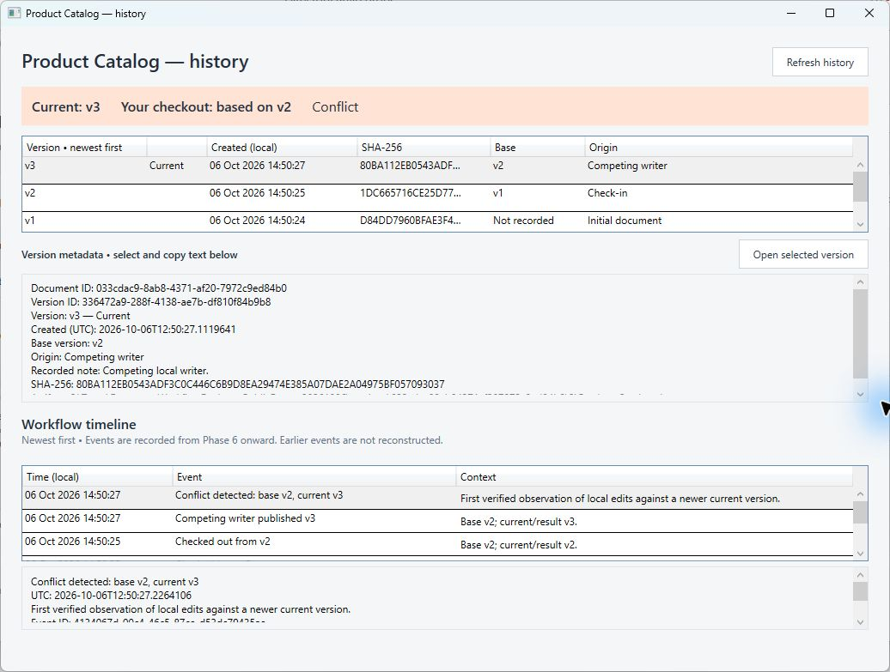
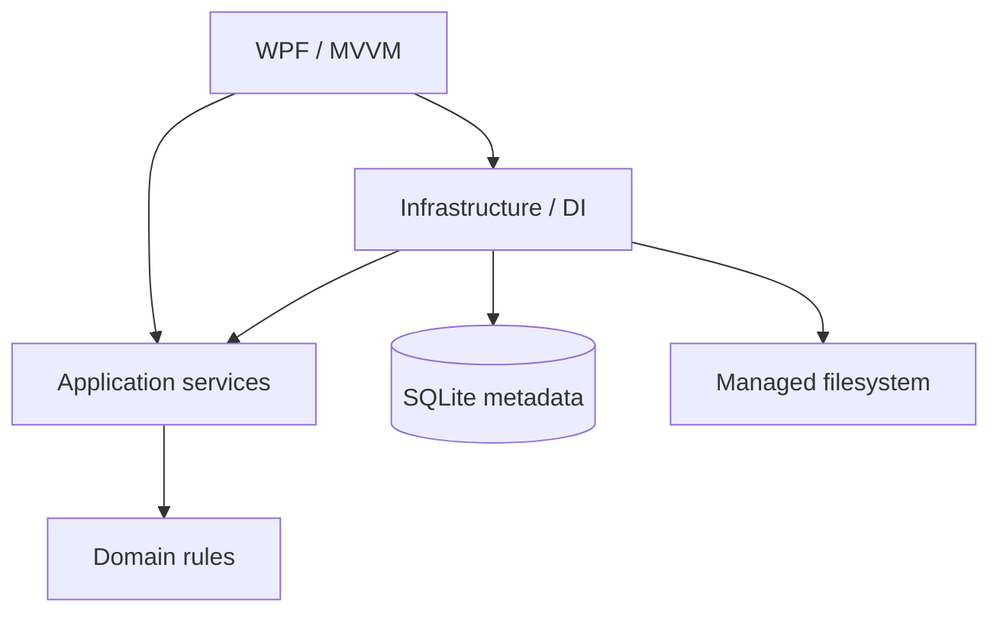

# Document Workflow Desktop

A Windows desktop application for safe local editing of versioned documents. Check out a managed copy, edit it in your usual application, detect changes by content, and explicitly check in an immutable version. Stale checkouts become conflicts that preserve local edits.

## Why this project exists

Document editing crosses two persistence systems: a database and a filesystem. This project explores how to keep checkout metadata, document bytes and history consistent when files change externally, another writer advances the version, or an operation is interrupted.

## Features

- Managed working copies with restart-safe checkout state.
- SHA-256 detection of Unchanged, Modified, Missing and unreadable files.
- Explicit check-in and immutable versions.
- Optimistic concurrency, safe conflict recovery and local-copy export.
- Verified historical inspection and an append-only audit timeline.
- Conservative recovery of interrupted staging and orphaned managed artifacts.
- Optional generic XLSX, DOCX and PDF demo content.
- Self-contained Windows x64 ZIP and a per-user installer.

## Screenshots

Modified working copy, ready for explicit check-in:



<details>
<summary>Conflict recovery and version history</summary>

A newer version blocks stale check-in while preserving local edits and recovery choices:



Immutable versions, the current version and the workflow audit timeline:



</details>

## Architecture

WPF views and MVVM commands call application services. Domain rules remain independent of UI and persistence. Infrastructure implements SQLite transactions, hashing and managed file storage.



See [architecture](docs/architecture.md), [workflow](docs/workflow.md) and [recovery](docs/recovery.md) for invariants and tradeoffs. Detailed [implementation history](docs/implementation-history.md) is retained separately.

## Interesting engineering decisions

- **Hashes instead of timestamps:** equal bytes mean Unchanged; touching a file does not imply an edit.
- **Immutable versions:** new content creates another artifact rather than replacing historical bytes.
- **Optimistic check-in:** a SQLite transaction verifies the checkout base before advancing the current version.
- **Preserve conflicts:** stale local edits cannot force-overwrite a newer version.
- **Conservative recovery:** database references define committed artifacts; unknown files remain untouched.
- **Append-only audit:** workflow transitions record typed events without rewriting past history.

## Reliability / Tests

**121 tests pass in Debug and Release, with zero build warnings or errors.** Coverage includes domain rules, SQLite transactions, external file changes, check-in rollback, concurrent writers, conflict recovery, interrupted staging, history, audit, MVVM commands, version metadata and delivery paths.

Local installer validation and its limits are recorded in [release validation](docs/phase7-validation.md). GitHub Actions is configured to verify both configurations on Windows for pull requests and pushes to `main`; remote execution is pending these commits being pushed.

## Getting Started

Development requires Windows and the .NET 9 SDK (`global.json` selects 9.0.305 with latest-feature roll-forward).

```powershell
git clone https://github.com/dstojanoviccc/document-workflow-desktop.git
cd document-workflow-desktop
dotnet restore DocumentWorkflow.sln
dotnet build DocumentWorkflow.sln -c Debug --no-restore -warnaserror
dotnet test DocumentWorkflow.sln -c Debug --no-build --no-restore
dotnet run --project src/DocumentWorkflow.App
```

Repeat build/test with `-c Release` for the release quality gate. [.NET 9 support](https://dotnet.microsoft.com/en-us/platform/support/policy) ends November 10, 2026; a supported-framework upgrade is a near-term maintenance task.

## Installation

Once the owner approves and publishes `v1.0.0`, the [GitHub Releases page](https://github.com/dstojanoviccc/document-workflow-desktop/releases) will contain the installer, portable ZIP and `SHA256SUMS.txt`. No public release is claimed yet.

The Windows x64 packages include the .NET runtime. Install for your current user, or extract the complete ZIP and run `DocumentWorkflow.App.exe`. An external editor/file association is required to edit Office/PDF documents. Packages are unsigned; Windows may show publisher or SmartScreen warnings.

User state lives in `%LOCALAPPDATA%\DocumentWorkflowDesktop`, independently of the executable. Upgrades and uninstall preserve it. See [installation and packaging](docs/installation.md) for checksums, backup, CLI packaging and reinstall behavior.

## Demo Walkthrough

1. Launch: a fresh user-data directory starts empty.
2. Click **Load demo data** to add five generic samples explicitly.
3. Check out **Product Catalog**, then **Open** it in your spreadsheet editor.
4. Edit and save, return to the app and Refresh if needed. Observe **Modified**.
5. Choose **Check in**. The current version advances to v2 and checkout completes.
6. Choose **View Details** to inspect v1/v2 and the workflow timeline.

Competing publication remains a service/test scenario. Automated tests demonstrate stale-base conflicts without adding a fake production publishing button. See [workflow examples](docs/workflow.md).

## Project Structure

| Location | Responsibility |
| --- | --- |
| `src/DocumentWorkflow.Domain` | Entities and workflow rules |
| `src/DocumentWorkflow.Application` | Contracts and use cases |
| `src/DocumentWorkflow.Infrastructure` | SQLite, managed storage and shell opening |
| `src/DocumentWorkflow.App` | WPF, MVVM and composition root |
| `tests/DocumentWorkflow.Tests` | Automated regression coverage |
| `demo-data` | Generic evaluation fixtures |
| `scripts`, `packaging`, `.github/workflows` | Local delivery and CI |
| `docs` | Architecture, installation and validation evidence |

## Limitations

This is a local application with optimistic concurrency, not a remote collaboration service. It has no automatic merge, force overwrite or updater. Storage corruption is outside normal recovery. Inspection copies can accumulate; unknown artifacts are deliberately retained. Filesystem recovery and audit writes cannot form one physical transaction. Actions predating audit persistence have no invented history.

## Roadmap

Future maintenance may upgrade the target framework, add owner-managed signing and refine inspection-copy retention. These ideas are not implemented.

## License

No license has been selected. Owner approval is required before adding one; public source availability does not by itself grant an open-source license.
